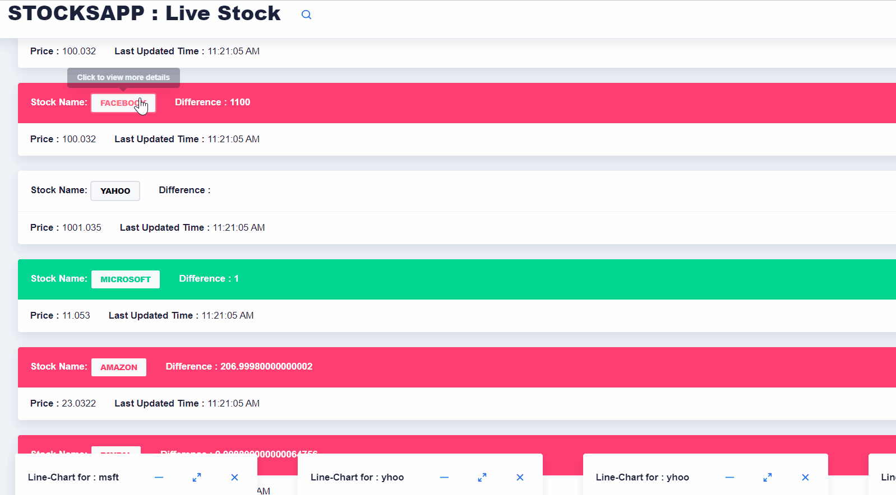

# Documentation 

Refer [StocksApp.pdf](https://github.com/aagamdoshi/StocksApp/blob/master/StocksApp.pdf) in the attached files for design, UI, UX, Graphs and other functionalities

This project was generated with [Angular CLI](https://github.com/angular/angular-cli) `version 8.0.3`.

## Demo

## Technology Used

`Angular 8`
`WebSockets`
`ng-admin UI`
`chart.js`
`d3.js`
`JavaScript`
`Bootstrap`

## Development server

Run `ng serve` for a dev server. Navigate to `http://localhost:4200/`. The app will automatically reload if you change any of the source files.
